本实验室的学习目标是让学生熟悉密钥加密的概念和一些常见的加密攻击。从这个实验室中，学生们将获得在加密算法、加密模式、划桨和初始向量（IV）方面的第一手经验。此外，学生们将能够使用工具和编写程序来加密/解密消息。开发人员在使用加密算法和模式时犯了许多常见的错误。这些错误削弱了加密的强度，并最终导致漏洞。这个实验室让学生面临其中的一些错误，并要求学生发起攻击来利用这些漏洞。本实验室涵盖以下主题：


• Secret-key encryption

• Substitution cipher and frequency analysis

• Encryption modes, IV, and paddings

• Common mistakes in using encryption algorithms

• Programming using the crypto library


Task 1: Frequency Analysis


# Task 3: Encryption Mode – ECB vs. cbc

```
openssl enc -aes-128-ecb -e -in pic_original.bmp -out ecb_pic.bmp -K 00112233445566778899aabbccddeeff
```

```
openssl enc -aes-128-cbc -e -in pic_original.bmp -out cbc_pic.bmp -K 00112233445566778889aabbccddeeff -iv 0102030405060708
```


```
head -c 54 pic_original.bmp >header

tail -c +55 ecb_pic.bmp > ecb_body
cat header ecb_body > newECB.bmp

tail -c +55 cbc_pic.bmp > cbc_body
cat header cbc_body > newCBC.bmp

```

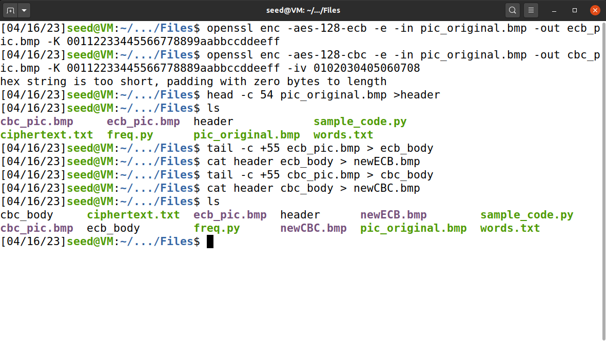


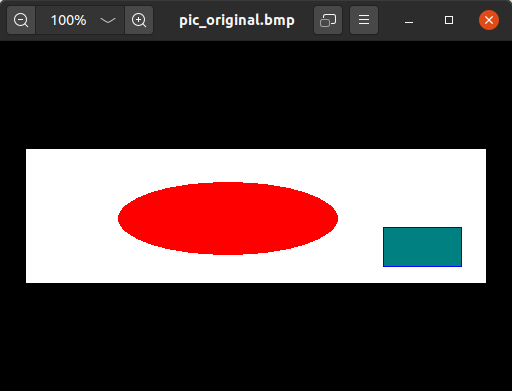


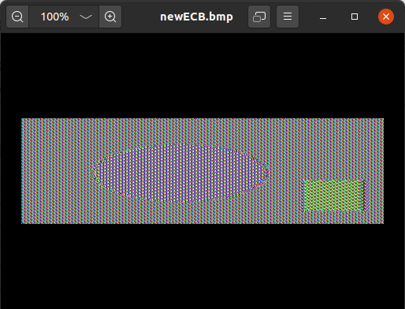


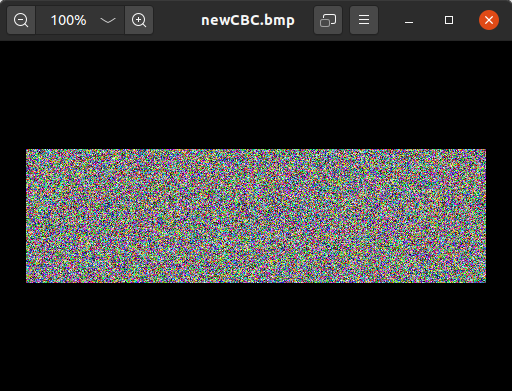

Viewing ECB encrypted image.


Viewing CBC encrypted image.


Viewing CBC encrypted image.


Viewing CBC encrypted file. Cannot make out any of the original image’s letters.


Yes, using the ECB encryption it is very easy to make out the shapes of the encrypted image. When using the CBC encryption I cannot see any relationship between the actual image and the encrypted image. When I ran the above encryption again with a newly chosen image, the results were the same. With ECB, I could make out some of the original image in the encrypted image. With CBC, I was unable to recognize any of the original image in the encrypted image.


```
openssl enc -aes-128-ecb -e -in frank.bmp -out ecb_frank.bmp -K 00112233445566778899aabbccddeeff
```

```
openssl enc -aes-128-cbc -e -in frank.bmp -out cbc_frank.bmp -K 00112233445566778889aabbccddeeff -iv 0102030405060708
```


```
head -c 54 frank.bmp >header

tail -c +55 ecb_frank.bmp > ecb_body
cat header ecb_body > ECBfrank.bmp

tail -c +55 cbc_frank.bmp > cbc_body
cat header cbc_body > CBCfrank.bmp

```

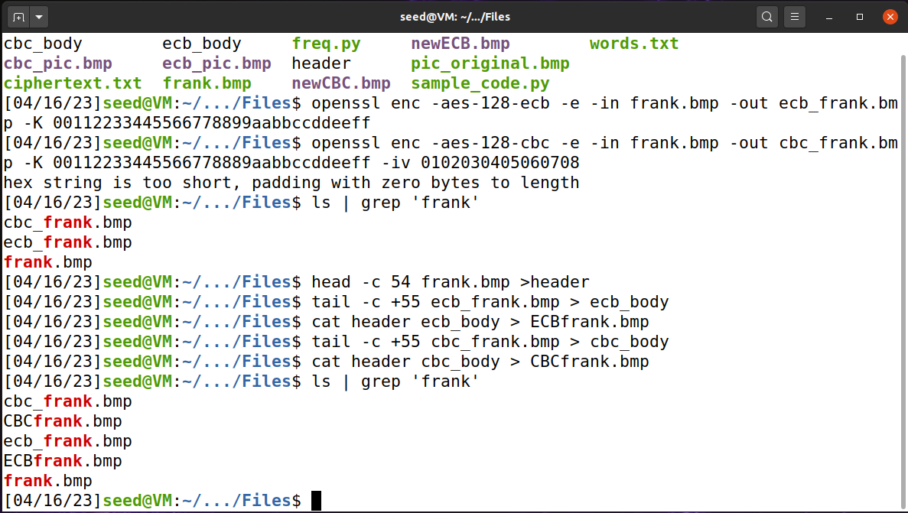


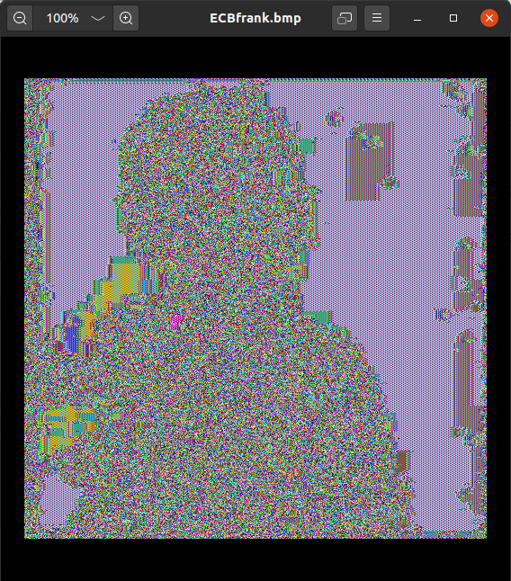


# Task 4: Padding


```
echo -n "12345" > f1.txt

openssl enc -aes-128-ecb -in f1.txt -out f1_ecb.txt -e -K 00112233445566778899aabbccddeeff

openssl enc -aes-128-cbc -in f1.txt -out f1_cbc.txt -e -K 00112233445566778889aabbccddeeff -iv 0102030405060708

openssl enc -aes-128-cfb -in f1.txt -out f1_cfb.txt -e -K 00112233445566778889aabbccddeeff -iv 0102030405060708

openssl enc -aes-128-ofb -in f1.txt -out f1_ofb.txt -e -K 00112233445566778889aabbccddeeff -iv 0102030405060708

```

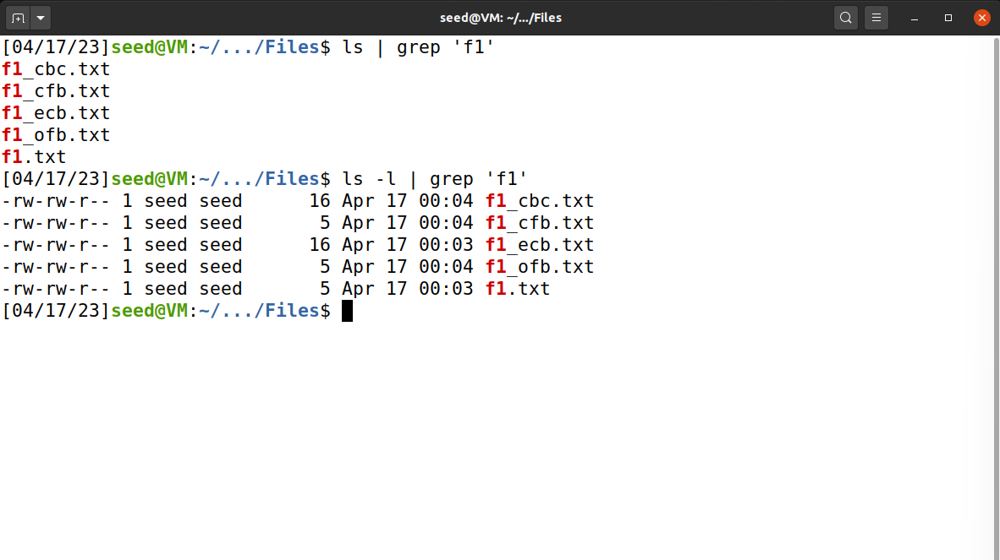


```
echo -n "123456789a" > f2.txt

openssl enc -aes-128-cbc -in f2.txt -out f2_cbc.txt -e -K 00112233445566778889aabbccddeeff -iv 0102030405060708

echo -n "123456789abcdefg" > f3.txt

openssl enc -aes-128-cbc -in f3.txt -out f3_cbc.txt -e -K 00112233445566778889aabbccddeeff -iv 0102030405060708
```

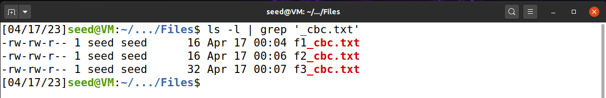


解密观察一下填充物，观察到解密的数据

```
openssl enc -aes-128-cbc -in f1_cbc.txt -out f1_cbc_d.txt -d -K 00112233445566778889aabbccddeeff -iv 0102030405060708 -nopad

openssl enc -aes-128-cbc -in f2_cbc.txt -out f2_cbc_d.txt -d -K 00112233445566778889aabbccddeeff -iv 0102030405060708 -nopad

openssl enc -aes-128-cbc -in f3_cbc.txt -out f3_cbc_d.txt -d -K 00112233445566778889aabbccddeeff -iv 0102030405060708 -nopad
```

```
xxd f1_cbc_d.txt
xxd f2_cbc_d.txt
xxd f3_cbc_d.txt
```

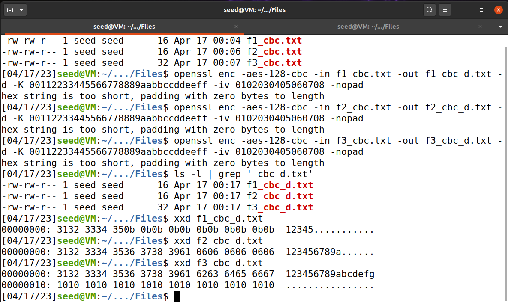


作者选择使用xxd  
xxd第一部分为这一行第一个byte的位置；  
xxd第二部分为这一行ASCII码转十六进制  
xxd第三部分为这一行原本的内容

根据输出，我们发现，CBC的填充内容每个字节都为该行的大小与满编的距离，例如该行有5字节，则空余部分每个字节均填充(0x10-0x05)=0x0b=11


# Task 5: Error Propagation – Corrupted Cipher Text

预测：  
ECB将只有第四组解密错误  
CBC将有第四组与第五组的解密错误  
CFB根据加解密的设置不同可造成影响不同，但至少当前组与下一组组将出现错误  
OFB将只有当前组解密错误

```

Create a filre.txt 

openssl enc -aes-128-ecb -in file.txt -out file_ecb -e -K 00112233445566778899aabbccddeeff

openssl enc -aes-128-cbc -in file.txt -out file_cbc -e -K 00112233445566778889aabbccddeeff -iv 0102030405060708

openssl enc -aes-128-cfb -in file.txt -out file_cfb -e -K 00112233445566778889aabbccddeeff -iv 0102030405060708

openssl enc -aes-128-ofb -in file.txt -out file_ofb -e -K 00112233445566778889aabbccddeeff -iv 0102030405060708

```


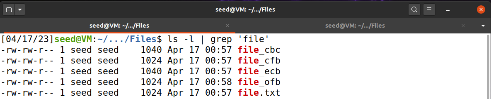


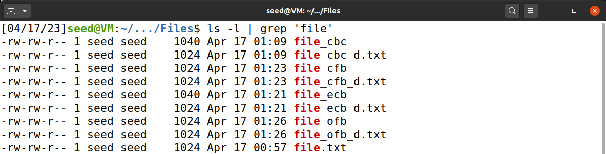

依次修改字符

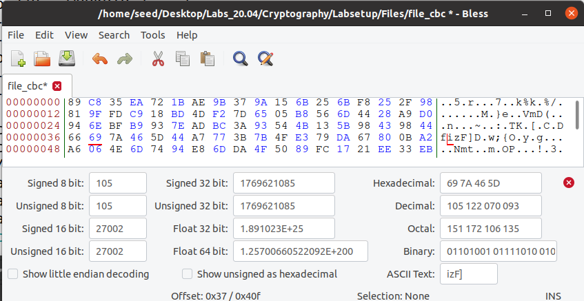


## cbc 
```

openssl enc -aes-128-cbc -in file.txt -out file_cbc -e -K 00112233445566778889aabbccddeeff -iv 0102030405060708 

bless file_cbc

openssl enc -aes-128-cbc -in file_cbc -out file_cbc_d.txt -d -K 00112233445566778889aabbccddeeff -iv 0102030405060708 

xxd file_cbc_d.txt

```


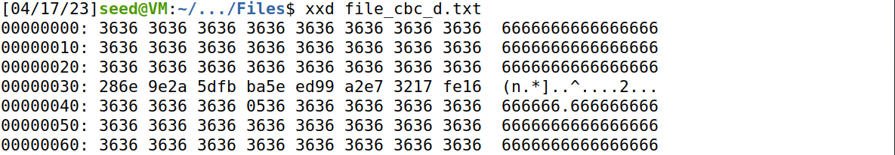


## ecb 
```

openssl enc -aes-128-ecb -in file.txt -out file_ecb -e -K 00112233445566778899aabbccddeeff

bless file_ecb

openssl enc -aes-128-ecb -in file_ecb -out file_ecb_d.txt -d -K 00112233445566778899aabbccddeeff

xxd file_ecb_d.txt

```

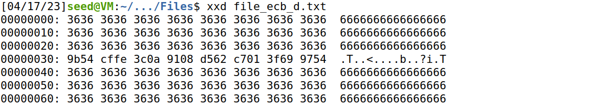


## cfb 
```
openssl enc -aes-128-cfb -in file.txt -out file_cfb -e -K 00112233445566778889aabbccddeeff -iv 0102030405060708

bless file_cfb 

openssl enc -aes-128-cfb -in file_cfb -out file_cfb_d.txt -d -K 00112233445566778889aabbccddeeff -iv 0102030405060708

xxd file_cfb_d.txt

```

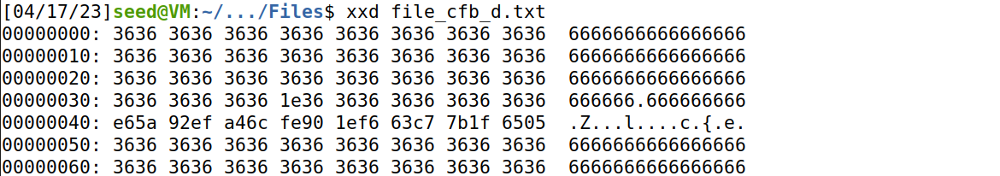

下一组整组错误

## ofb
```
openssl enc -aes-128-ofb -in file.txt -out file_ofb -e -K 00112233445566778889aabbccddeeff -iv 0102030405060708

bless file_ofb

openssl enc -aes-128-ofb -in file_ofb -out file_ofb_d.txt -d -K 00112233445566778889aabbccddeeff -iv 0102030405060708

xxd file_ofb_d.txt
```

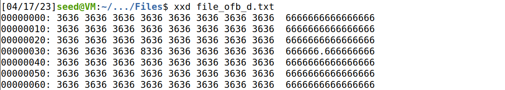


没有扩散问题

# Task 6: Initial Vector (IV) and Common Mistakes

## Task 6.1. IV Experiment

```

openssl enc -aes-128-ofb -in file.txt -out file_iv -K 00112233445566778889aabbccddeeff -iv 0102030405060708
openssl enc -aes-128-ofb -in file.txt -out file_iv1 -K 00112233445566778889aabbccddeeff -iv 0102030405060708
openssl enc -aes-128-ofb -in file.txt -out file_iv2 -K 00112233445566778889aabbccddeeff -iv 8070605040302010

diff -a file.iv file_iv1 
diff -a file.iv file_iv2 
```

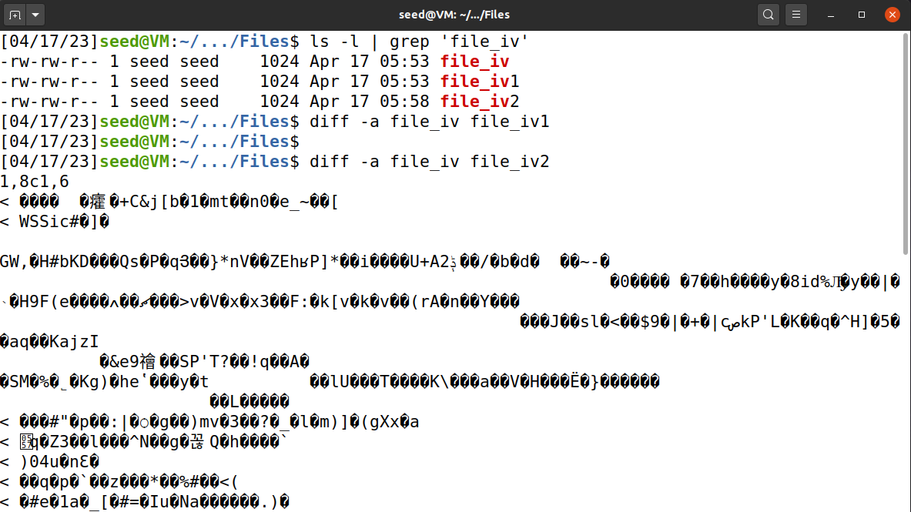

可以发现，在相同key下，使用相同iv将导致加密结果相同，使用iv等于变相增强加密密钥的复杂度

## Task 6.2. Common Mistake: Use the Same IV

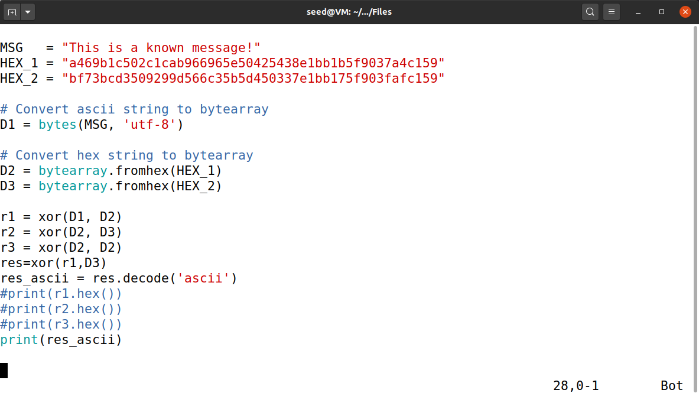

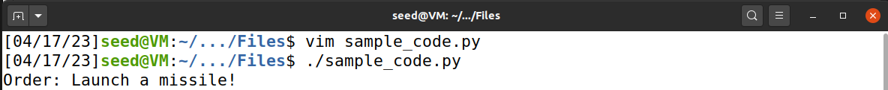


## Task 6.3. Common Mistake: Use a Predictable IV

```
Yes=5965730d0d0d0d0d0d0d0d0d0d0d0d0d

No=4e6f0e0e0e0e0e0e0e0e0e0e0e0e0e0f
```


```
#!/usr/bin/python3

# XOR two bytearrays
def xor(first, second):
    return bytearray(x ^ y for x, y in zip(first, second))


Yes = "5965730d0d0d0d0d0d0d0d0d0d0d0d0d"
NO = "4e6f0e0e0e0e0e0e0e0e0e0e0e0e0e0e"

# 将HEX_1，和HEX_2变成从外界输入
Bob = input("Bob's ciphertext:")
HEX_1 = input("The IV used:")
HEX_2 = input("Next IV:")

# Convert hex string to bytearray
D1 = bytearray.fromhex(Yes)
D2 = bytearray.fromhex(NO)
D3 = bytearray.fromhex(HEX_1)
D4 = bytearray.fromhex(HEX_2)

print("Choose Yes to encrypt:")
r1 = xor(xor(D1, D3), D4)

print("Enter the following information into Your plaintext:")
print(r1.hex())

YC = input("GET 'Your ciphertext':")

if YC[0:len(Bob)] == Bob:
    print("Yes")
else:
    print("No")
```

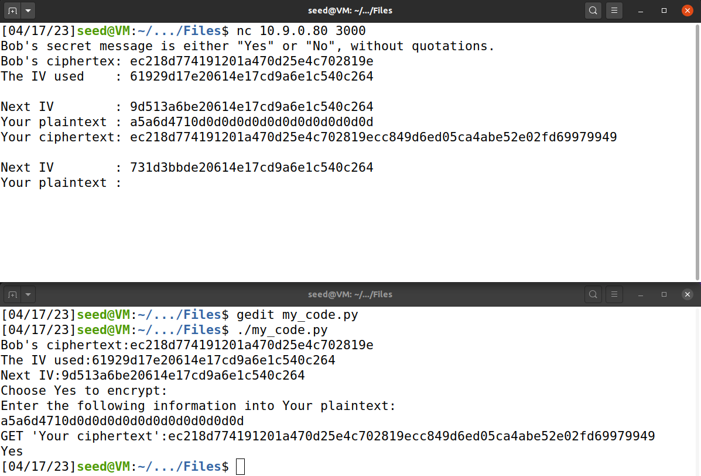